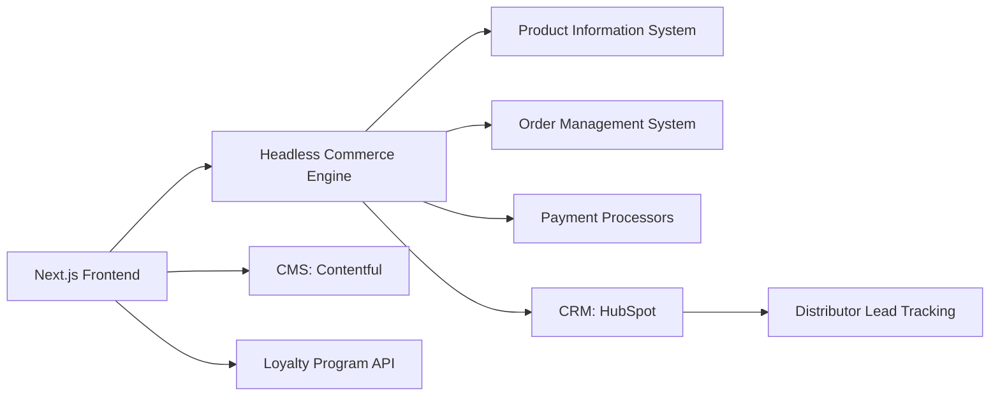

# **Product Requirements Document: Aqua Premium E-commerce Platform**

## 1. Project Overview
**Goal**: Transform aqua.bluepanda.cloud into a premium B2C/B2B e-commerce experience for AquaGlow's Dorron cleaning products, maintaining existing B2B functionality while adding full B2C capabilities.

**Current State**: Minimalist lead-generation site focused on distributor inquiries with:
- Clean aesthetic and premium visual language
- Strong B2B focus ("Become a Distributor" flow)
- WhatsApp/email contact options
- Product showcase without purchasing capability

**Target State**: A unified platform serving both:
- **B2C Consumers**: Full shopping experience with accounts, cart, and checkout
- **B2B Clients**: Enhanced distributor portal with bulk ordering and account management

## 2. Design Direction
### 2.1 Aesthetic Enhancements
- **Color Palette**: 
  - Primary: Deep aqua blue (#006994) from existing brand
  - Secondary: Clean white (#FFFFFF) + light gray (#F5F7FA)
  - Accent: Coral (#FF7E67) for CTAs (replacing gold for better accessibility)
- **Typography**:
  - Headings: Playfair Display (premium serif for brand moments)
  - Body: Inter (clean, readable sans-serif)
- **Visual Language**:
  - Maintain existing spacious layout and generous whitespace
  - Add subtle glass-morphism effects on CTAs
  - Implement micro-animations on hover/click
  - High-res lifestyle imagery showing products in homes/retail settings

### 2.2 Key UI Components
- **Premium Elements**:
  - Floating cart with slide-out animation
  - Gradient overlays on hero sections
  - Product image zoom with color consistency check
  - "Shop the Look" inspiration sections
- **B2B Preservation**:
  - Maintain existing distributor inquiry flow
  - Add "Request Quote" option for bulk orders
  - Keep WhatsApp/email contact buttons

## 3. Functional Requirements
### 3.1 Core E-commerce (B2C)
| Feature | Specification |
|---------|---------------|
| Product Catalog | - Category filtering (by room, surface, scent)<br>- Sustainability attributes (vegan, eco-friendly)<br>- Customer reviews with photo uploads |
| Shopping Cart | - Persistent cart across sessions<br>- Promo code support<br>- Estimated delivery timeline |
| Checkout Flow | - Guest checkout option<br>- Multiple payment: Cards, PayPal, Apple/Google Pay<br>- Address auto-complete |
| User Accounts | - Order history & tracking<br>- Wishlists & saved carts<br>- Subscription management (auto-replenishment) |
| Special Features | - "Cleaning Routine Builder" tool<br>- AR product preview (mobile)<br>- Loyalty program integration |

### 3.2 B2B Functionality
| Feature | Specification |
|---------|---------------|
| Distributor Portal | - Bulk order pricing tiers<br>- Reorder manager with past purchases<br>- Account representative contact |
| Inquiry System | - Enhanced form with:<br>  • Company name/type field<br>  • Estimated volume dropdown<br>  • Product interest checklist<br>- "Quick Quote" option for pre-qualified leads |
| Bulk Order Flow | - Configurable cart (cases/pallets)<br>- Volume discount indicator<br>- Trade account registration |

### 3.3 Content & Marketing
- **Content Hub**:
  - "Cleaning Academy" blog with usage tips
  - Sustainability reports and ingredient transparency
  - Downloadable POS/shelf planning kits (B2B)
- **Personalization**:
  - Recommended products based on browsing
  - Room-specific product bundles
  - "Restock Reminders" for consumables

## 4. Technical Implementation
### 4.1 Architecture


### 4.2 Key Integrations
1. **Commerce Platform**: Medusa.js or Shopify Plus (headless)
2. **Payment**: Stripe (primary) + PayPal + Braintree
3. **CRM**: HubSpot (lead scoring for distributors)
4. **Fulfillment**: ShipStation + EasyPost (real-time rates)
5. **Analytics**: Google Analytics 4 + Hotjar

## 5. User Flow Integration
**Unified Navigation**:
```
[Premium Header]
└── Home
└── Products → [B2C Catalog] | [B2B Bulk View]
└── Solutions → [For Home] | [For Business]
└── Academy (Content)
└── Distributors → [Inquiry Form] | [Partner Login]
└── [Account/Cart Icons]
```

**Conversion Paths**:
- **B2C**: Search → Product Page → Cart → Checkout → Account Creation
- **B2B**: Solutions → Bulk Pricing → Inquiry Form → WhatsApp Follow-up

## 6. Success Metrics
| KPI | Target | Measurement |
|-----|--------|-------------|
| B2C Conversion Rate | 3.2% | GA4 Enhanced E-commerce |
| AOV (B2C) | $45 | Order Value Analysis |
| B2B Lead Quality | 35% | CRM Lead Scoring |
| Mobile Revenue | 55% | Device Performance |
| Sustainability Attribute Clicks | 25% | A/B Testing |

## 7. Phase Implementation
### Phase 1: Foundation (6 weeks)
- Design system implementation
- Product catalog migration
- B2C cart/checkout build

### Phase 2: B2C Launch (4 weeks)
- Core shopping experience
- User account features
- Basic content migration

### Phase 3: B2B Integration (3 weeks)
- Distributor portal
- Bulk pricing engine
- CRM lead flow

### Phase 4: Optimization (3 weeks)
- Personalization engines
- Loyalty program
- AR/visual features

## 8. Risks & Mitigation
| Risk | Mitigation |
|------|------------|
| B2B/B2C UX conflict | Separate but parallel flows with unified design language |
| Blue Panda limitations | Core frontend on Vercel with API-based commerce backend |
| Premium perception gap | High-end product photography and premium micro-interactions |
| Distribution lead decline | Maintain existing form + add live chat qualification |

This transformation maintains the site's existing premium aesthetic while adding full e-commerce capabilities. The dual-flow approach serves both consumers and business clients without compromising either experience, positioning Dorron as a premium brand in both B2C and B2B markets.